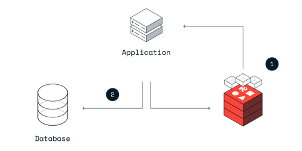

# spring-data-redis-cache

This project demostrates the use of Redis as a cache for a MySQL  database using the Cache-Aside strategy. It implements dynamic TTL.

### Cache Aside Pattern



This is the most common way to use Redis as a cache. 
Cache-aside is an excellent choice for read-heavy applications when cache misses are acceptable. 
The application handles all data operations when you use a cache-aside pattern, and it directly communicates with both the cache and database.

---

### How to run project

1. Clone the project

```bash
git clone git@github.com:bruce-mig/spring-data-redis-cache.git
```

2. Run persistence stack with docker.

```bash
cd spring-data-redis-cache
docker compose up -d
```

3. Start the application
```bash
sudo chmod +x mvnw
./mvnw spring-boot:run
```

The application is listening on port `:9696`

You can execute CRUD operations at the path `:9696/users`.

### Monitoring via redis-cli

```bash
 redis-cli -h <host> -p 6379 -a <redis-password> monitor | grep -v 'info'
```


Learn more about caching at [redis](https://redis.io/solutions/caching/)